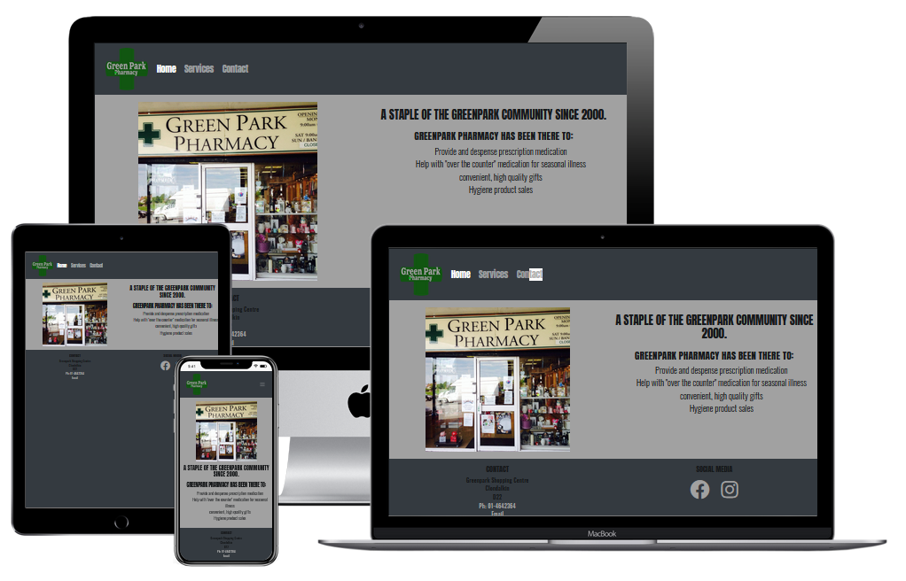
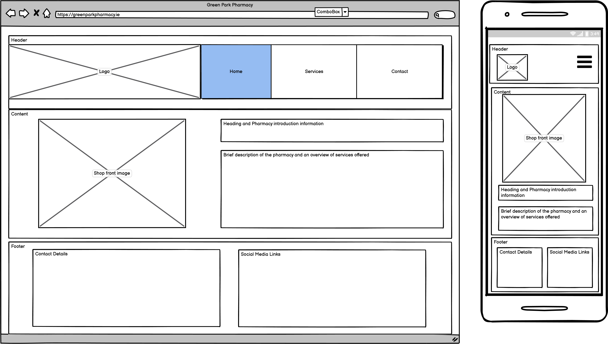
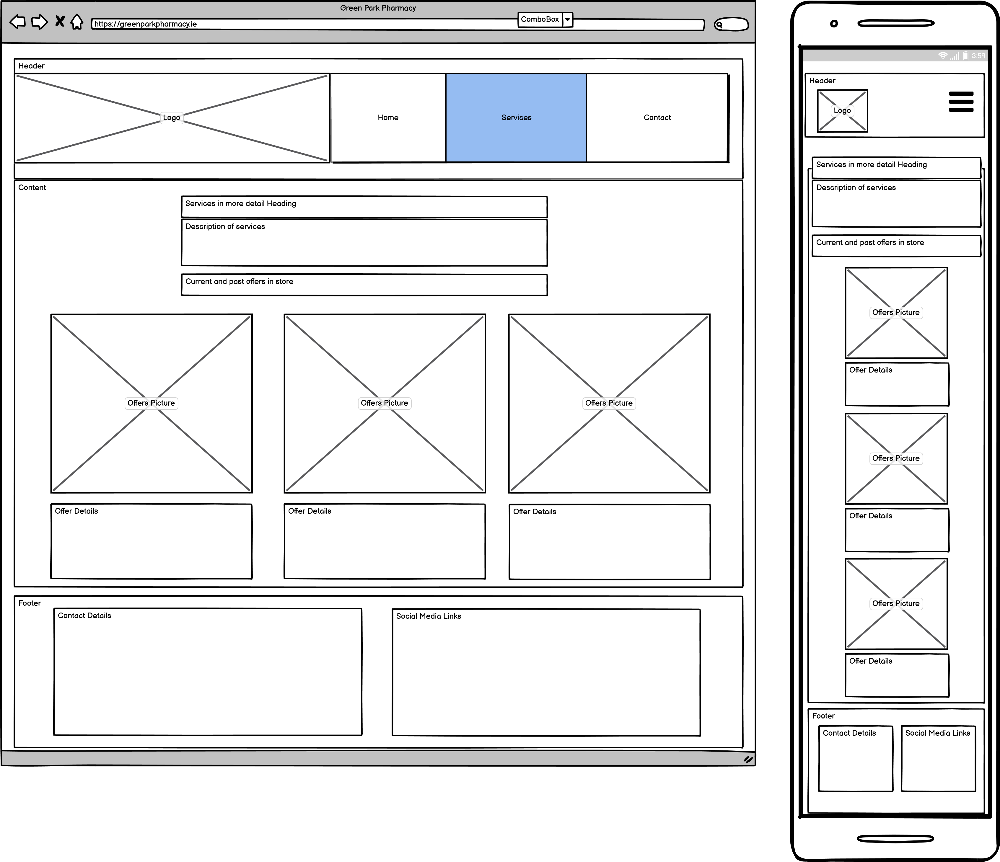
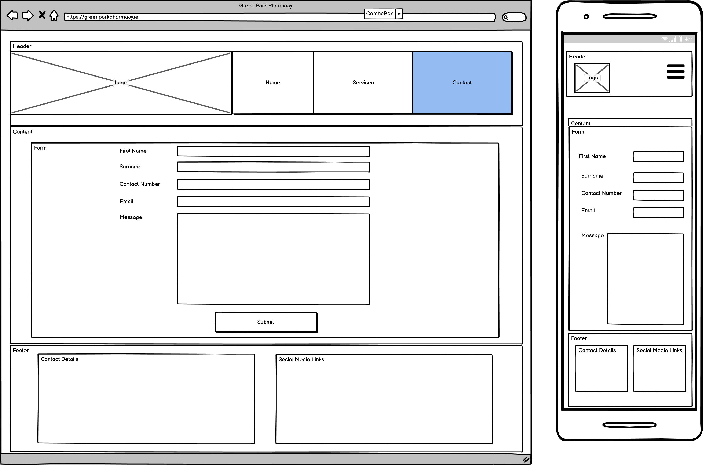

# MS1
Milestone project one for code institute

## Table of Contents
* [Purpose](#Purpose)
* [User Experience Design (UX)](#User-Experience-Design)
  * [User stories](#User-Stories)
    * [First Time Visitor Goals](#First-Time-Visitor-Goals)
    * [Returning Visitor Goals](#Returning-Visitor-Goals)
    * [Frequent User Goals](#Frequent-User-Goals)
  * [Structure](#Structure)
    * [Design](##Design)

# Milestone Project 1
## Purpose
This Website was created for the sole purpose of completing the first Milestone Project for the Code Institute's Full Stack Developer course. 
It was built using the knowledge gained from the HTML, CSS and User Centric Design modules. A full list of technologies used can be found in the technologies section of this document.
The live website can be found [here](https://github.com/gardoyle27/MS1).
## Green Park Pharmacy Responsive Website

*** 
## User Experience Design
### User stories
#### First Time Visitor Goals
* As a First Time user, I want to view the website and content clearly on my mobile device.
* As a First Time user, I want to easily understand the main purpose of the site and learn more about my local pharmacy.
* As a First Time user, I want to be able to easily navigate throughout the site to find content.
* As a First Time user, I want to find ways to see great deals on the various social media platforms Green park Pharmacy uses.

#### Returning Visitor Goals
* As a Returning user, I want to order my prescriptions online to make collecting my medication easier.
* As a Returning user, I want to contact the company to confirm my order is ready when I arrive at the pharmacy.

#### Frequent Visitor Goals
* As a Frequent user, I want to check to see if there are any new services my pharmacy offer.
* As a Frequent user, I know my pharmacy sells more than just medication. I want to be able to see what gifts are available .
* As a Frequent user, I want to sign up to the Newsletter so that I am emailed any major updates and/or changes to the website or organisation.
### Structure
All Pages will be systematically consistent in layout. They will contain a logo (which will also result in being a link to the home page) and a navigation menu at the top of the Webpage that will traverse the site easily.
The purpose of this is to fulfil user story:
> As a First Time user, I want to be able to easily navigate throughout the site to find content.

The Home Page will contain a small bio about the Pharmacy.
The purpose of this is to fulfil user story:
> As a First Time user, I want to easily understand the main purpose of the site and learn more about my local pharmacy.

Custom CSS and/or Bootstrap will be used to make the Website responsive by the use of media queries and/or the Bootstrap Grid system.
All pages will be responsive and the layouts will change dependant on screen size. This is to ensure content flow is appealing and consistent,
This will include images and the Nav Menu will be collapsible on a Mobile device to make use of space on smaller devices
The purpose of this is to fulfil user story:
> As a First Time user, I want to view the website and content clearly on my mobile device.

Each page of the site will contain a footer. The footer will contain contact details and social media details. The social media details will link to the different social media accounts  and will open in a new tab. Rather than using text Font-Awesome icons will be used to make the visual representation that is used in modern website building

## Design

because pharmacutical companies are known for being clean and sterile I wanted to vring that into the design, however I did not want to bring the brightness of a very white based colour scheme to achieve this. 
I instead decided to keep it clean but with a darker theme for the header and footer to make a bold impression but used an off white similar to the shop sign for the main content section for some contrast.

The logo was designed to be a similar colour green, again, to the shop sign however rather than just having a font i decided to incorporate the well known lighter green cross associated with pharmacies and intrpduce it as part of the text.

these greens where then incorporated into the links within the website to help with noticing when they are hovered over and completed the design process I had in mind

a simplistic menu to navigate around the website was used aswell as some large icons for linking to social media sites are contained in the footer.

The website is broken into 4 seperate pages.

### Home
 A basic introduction to the pharmacy, with a brief description of what they are about and what services are offered

### Services
The services section continues on from the home page but goes into more detail. below this comprehensive list of services a gallery of what non-medical items are sold. One of the services on offer is a "click and collect" service that a customer can request their prescription from a distance

### Contact us
The Contact us contains a form. this form is to get contact details of the customer and allows for the uploading of files so that customers can upload a picture of their prescription to avail of the "click and collect" service. but also allows for general customer queries  to be submitted

### Success
once the customer has submitted a form the user should be given some feedback as to if this was succesful or not. a page redirect to this page will suffice as there is no back end for the web app to tie into.

## Wireframes

Home Page

 

Services Page
 

Contact us Page
 

##Technologies

* HTML
    * The project is mainly using HTML fpr the stucture

* CSS
    * the project uses a custom css file to style  standalone components and overwrite some bootstrap styling

* [Bootstrap](https://getbootstrap.com)
    * Bootstrap is used for styling and layouts including the pop out menu for mobile viewers

* [Font Awesome](https://fontawesome.com/)
    * font awesome has been availed of to access the social media icons

* [Google Fonts](https://fonts.google.com/)
    * two fonts have been used that are from google fonts they are "oswald" and "anton"

* [GitHub](https://github.com/)
    * Github repo's where used to formally follow the progress of the build.
    * Github has also been used to host the live website

* [Gitpod](https://gitpod.com/)
    * Gitpod was used as the ISE for writing the code

* [Balsamiq Wireframes](https://balsamiq.com/wireframes/)
    * Balsamiq was used for the creation of the wire frames/user stories to stage the website design/layout

* [Techsini](http://techsini.com/multi-mockup/index.php)
    * is a webiste that outputs a visual aid of how a website looks on different screen sizes (First image of the read me)

* [GIMP](https://www.gimp.org/)
    *GNU Image Manipulation Program (GIMP) is an open source software for editing and creating images. it was used to create the logo and to resize the images used on the website.

## Testing

During the building of this website each component was checked in 3 main browsers. Edge, Firefox and google chrome. 

links where tested to ensure that the navigation behaved as expected. unfortunatley the submit button is throwing a 405 error when trying to post. I did search the web for a resolution but any that I found were not able to resolve this.

before uploading all code was tested in the requested html/css validators

## Credits
### Regular Expression 
In order to validate the email address the regex from [stackoverflow](https://stackoverflow.com/questions/5601647/html5-email-input-pattern-attribute) was used

### Submit input
the following link was used as part of trying to fix the redirect issue I faced [Stackoverflow](https://stackoverflow.com/questions/44221250/redirecting-to-a-page-after-submitting-form-in-html)

## Media
with the exception of the logo which was created by me, all other photo's have been taken from the [Greenpark Pharmacy Facebook page](https://www.facebook.com/Green-Park-Pharmacy-344888668942728/?ref=page_internal) and permission was given by Fintan Moore of Greenpark Pharmacy

## Special Thanks
### I'd like to give a special thanks to my mentor Gurjot Singh and to the very helpful student care team